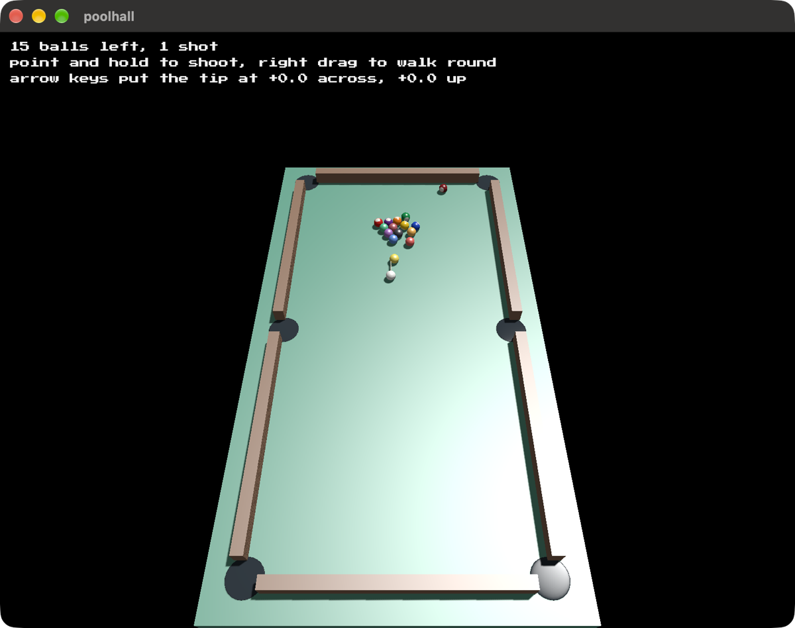

# poolhall

It's like pool, but different.



Built on [blitzkit](https://github.com/jvalol/blitzkit), the tenth game on that
engine.

```
cargo run
```

---

I asked AI to draft this for me. I've edited it. Any surviving AI smells are my oversight.
